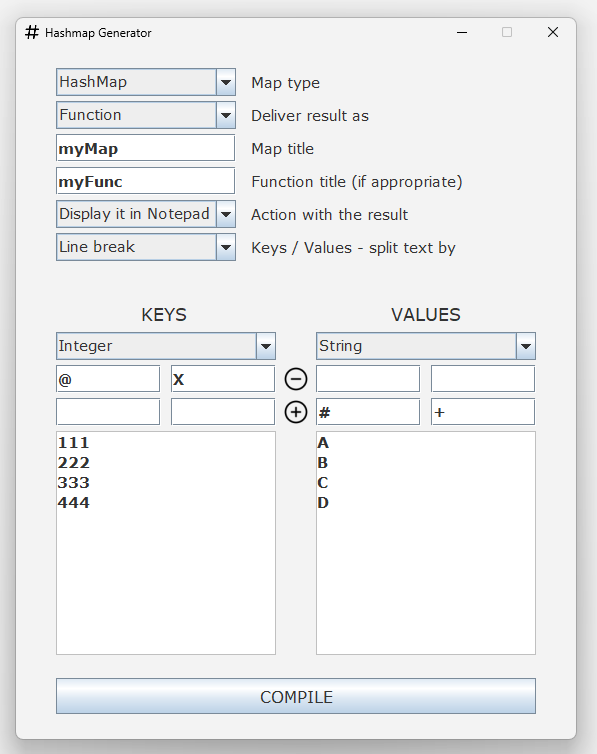

# HashMap Generator
- Helps to compile your HashMap code using `Swing` UI.
- Inspired by my [XChange](https://github.com/K4KarolE/XChange/blob/main/app/src/main/java/karole/CurrencyMap.java) project.
- Please note, the string truncation is whitespace/string's length based as you can see below on the `KEYS` side / `Notepad` result snip.

    

 

    

 

## Requirements
### Java - used: 22
- https://www.oracle.com/java/technologies/downloads/

## Thank you all who worked on the modules used in this project!
